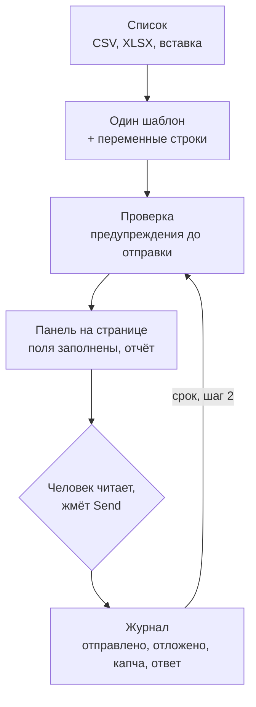

# Аутрич через контакт-формы: как не выглядеть спамом

Владельцы сайтов относят до двух пятых заявок с форм к мусору, аутрич в том числе. Два способа туда попасть и бесплатное расширение, которое оставляет Send человеку.

Source: https://ru.spintax.site/contact-form-outreach-without-becoming-the-spam/
Published: 2026-09-02
Facts checked: 2026-09-02

---

Начните с принимающей стороны. Плейбук по защите веб-форм, опубликованный 13 августа 2026,
описывает, что его автор увидел, разбирая партии заявок с контакт-форм:

> somewhere between a fifth and two-fifths of submissions were junk — random-string bot fills, link-building outreach, and budget-inflation pitches.

Аутрич ради ссылок стоит в этом списке между заполнением случайными строками и предложениями
раздуть бюджет. В эту категорию его записали партии заявок одного ревьюера, ещё до того, как
кто-нибудь прочитал сами сообщения. Защита, которую тот же плейбук советует, по порядку: поле
honeypot, ограничение частоты и в самом конце CAPTCHA, потому что:

> CAPTCHA sits last in the order for a UX reason — it is the only layer that taxes every legitimate visitor.

Akismet, фильтр, который по собственным подсчётам стоит больше чем на 100 миллионах сайтов,
сообщает, что удалил свыше 500 миллиардов спам-сообщений с точностью 99.99%. Это цифры самого
вендора, и с чем именно он сравнивает заявку, вендор не публикует.

Так что тот, кто пишет через контакт-формы, ради гостевого поста, партнёрства, размещения в
каталоге или отклика на вакансию, проигрывает одним из двух способов, о которых эта статья.

## Два способа проиграть

**Выглядеть как бот.** Автоматизированный сегмент рынка рекламирует ровно то, против чего
построена защита: вставьте несколько сотен доменов, дайте модели сопоставить поля, решите
CAPTCHA, отправьте, платите за каждую успешную отправку. Ограничение частоты существует ради частоты
отправок, проверка — ради того, кто решает CAPTCHA, honeypot — ради модели, заполняющей
каждое поле, какое найдёт, и на каждом шаге из этого списка сообщение уходит на страницу,
которую никто не читал.

**Выглядеть как копия.** У ручного сегмента своя беда. Вставьте одно сообщение в 200 форм, и
200 сайтов получат один и тот же текст. Владельцу сайта, который уже видел его в блоге коллеги,
фильтр не нужен, а фильтр, который учится сразу на многих сайтах, если он так устроен, получает
199 шансов выучить этот текст до последней отправки.

Инструменты для ручного аутрича сошлись на одном действии: кнопка копирует готовое сообщение и
открывает контакт-форму, дальше человек нажимает Send и отмечает строку как выполненную. Сам
принцип верен. Человеку остаются те самые две задачи: написать 200 сообщений, а не одно, и
вставить каждое в нужные поля без ошибок.

## Один шаблон, список и человек на Send

Именно этот пробел закрывает [Spintax Manual Outreach Helper](https://github.com/investblog/spintax-extension),
и его выход стал поводом для статьи. Это наше расширение, бесплатное, под GPL; с 28 августа 2026
версия 0.2.1 доступна в
[Chrome Web Store](https://chromewebstore.google.com/detail/gjmkkcgkhnfibcoghhdpffkjfdmeocei),
[Edge Add-ons](https://microsoftedge.microsoft.com/addons/detail/joddeoojfbefdpfbbhannlhofakamlld)
и [Firefox Add-ons](https://addons.mozilla.org/firefox/addon/spintax/).

Порядок работы тот же, что у ручных инструментов, только два пробела закрыты:

1. **Импорт списка.** CSV, XLSX или вставка из таблицы. Колонки становятся переменными
   (`%name%`, `%site%`, `%topic%`), роли определяются по значениям, дубли объединяются по
   ключу цели: домен для URL, адрес для почты, хэндл для профиля.
2. **Один шаблон** на spintax, или пусть встроенный промпт набросает его в вашем чате.
   Расширение ничего не отправляет ни одной модели: оно открывает промпт во вкладке или
   копирует его в буфер.
3. **Экран проверки** до первого сообщения: переменные подсвечены, есть предупреждения о
   пустой переменной, о скобке, оставшейся в тексте, о поле длиннее, чем допускает форма.
4. **Боковая панель на целевой странице.** Помощник распознаёт контакт-форму, заполняет из
   этой строки поля, которые понимает, сообщает, что куда попало и чего не нашёл, и ждёт. Вы
   читаете сообщение, сами нажимаете Send на странице и отмечаете строку. Следующая уже
   открыта.
5. **Фоллоу-апы как шаги.** В назначенный день строка возвращается в ту же очередь с шаблоном
   второго шага. Исходы, отправлено, отложено, нет формы, капча, ответили, отказали, лежат в
   локальном журнале, который можно экспортировать.



Ограничения заложены в архитектуру, а не вынесены в настройки. Из README:

> It never submits a form, never solves a captcha, never scrapes a page, never adds "human-like" delays. That boundary is a design rule, not a setting.

Манифест этой фразе соответствует, как и обоснования разрешений, поданные в магазины: ни host
permissions, ни content scripts при установке. Заполнение формы запрашивает доступ к одному
origin, по кнопке Fill, в момент нажатия, а у внедряемого скрипта нет ветки кода, которая
вызывала бы submit. По тем же документам у расширения нет сервера, аккаунта и аналитики, и оно
не делает ни одного сетевого запроса, пока вы сами не включите единственную необязательную
ленту новостей.

## Измерено на собственном шаблоне

Расширение поставляется с демо-кампанией: гостевые посты по пяти целям, четыре демо-страницы и
один адрес почты, с шаблоном примерно на 45 слов, так что весь цикл можно пройти, не трогая
настоящий сайт. В шаблоне 14 мест по два варианта, 16 384 формулировки на бумаге. Проверки
заслуживает правило рендера, потому что именно оно отличает очередь из 200 сообщений от одного
сообщения, вставленного 200 раз: seed каждой строки складывается из её ключа и номера шага,
поэтому один и тот же сайт всегда получает одну и ту же формулировку, а фоллоу-ап — другую.

Двести синтетических строк через движок, встроенный в расширение,
[@spintax/core](https://spintax.net/spintax-engines/):

| Вопрос | Измерено |
| --- | --- |
| Различных формулировок на 200 строк, значения из строк убраны | 197 из 200 против 199, которые даёт арифметика парадокса дней рождения |
| Одна и та же строка отрендерена дважды | одинаково, все 200 |
| Второй шаг на той же строке отличается от первого | 199 из 200 |
| Строки с пустым значением `%topic%` | 25 из 25 отрендерены с заметной дырой, ровно такой, какую экран проверки и должен подсветить |
| Доля сообщения, одинаковая в 95% строк | 7.1%: сама просьба, «accept a guest post for» |

Первая строка — весь аргумент в одном числе. Шаблон примерно на 45 слов, написанный один раз,
даёт 200 блогам 197 разных сообщений, а блог номер 140 получает одно и то же каждый раз, когда
вы открываете его строку. Последняя строка — оговорка к первой, и это та же находка, что в
[замере холодных писем](/spintax-in-cold-email-how-much-is-too-much/): неизменной остаётся
просьба, а её читатель как раз и должен узнать.

Файл — [measure.mjs](/measurements/manual-outreach/measure.mjs); ему нужны Node и движок из
npm:

```bash
npm install @spintax/core@0.6.1
node measure.mjs
```

## Где расширение останавливается

Оно распознаёт поля по атрибутам autocomplete, типам полей и подписям на семи языках и
запоминает сопоставление для каждого сайта как рецепт. Поле, которое оно не смогло определить,
вы указываете один раз сами; в rich-редактор, Gmail или LinkedIn, текст попадает через буфер
обмена. CAPTCHA — это исход в журнале, а не задача, которую расширение решает. Оно не читает за
вас целевую страницу, не ищет страницу контактов и не говорит, стоит ли вообще писать на этот
сайт.

Магазинная история заслуживает отдельного абзаца, потому что тема статьи случилась с её же
героем. 26 августа 2026 Chrome Web Store удалил расширение из каталога: в описании были
перечислены конструкторы форм, которые помощник распознаёт, и магазин счёл список набивкой
ключевыми словами. Исправленный текст в тот же день отклонил автомат; апелляцию удовлетворили
27 августа, пакет остался тем же. Помощник, построенный так, чтобы каждое сообщение отправлял
человек, а не скрипт, на день оказался в одной категории со скриптами.

## При чём тут spintax

Ничто в описанном цикле не требует хитрого синтаксиса шаблонов. Демо-шаблон использует самую
простую конструкцию из возможных, два варианта в фигурных скобках, четырнадцать раз, и на 200
строк этого хватает. Синтаксис даёт другое: сообщение вообще может быть шаблоном, с переменными
из строки, с фоллоу-апом как вторым шагом, а не второй кампанией, и с формулировкой, которую
можно воспроизвести по ключу строки, когда кто-нибудь спросит, что именно вы отправили.

На spintax.net объясняется, как выбирать фрагменты для вариативности и какие части текста лучше
оставить неизменными: [страница про холодные письма](https://spintax.net/spintax-for-cold-email/)
о том, где вариативность уместна, и [гайды по авторству](https://spintax.net/docs/authoring-mindset/)
о том, как её писать. Расширение — последний инструмент в этом конвейере, и решение нажать Send
остаётся за человеком. Попадает ли после этого сообщение в папку спама, в этой статье не
измерялось.
