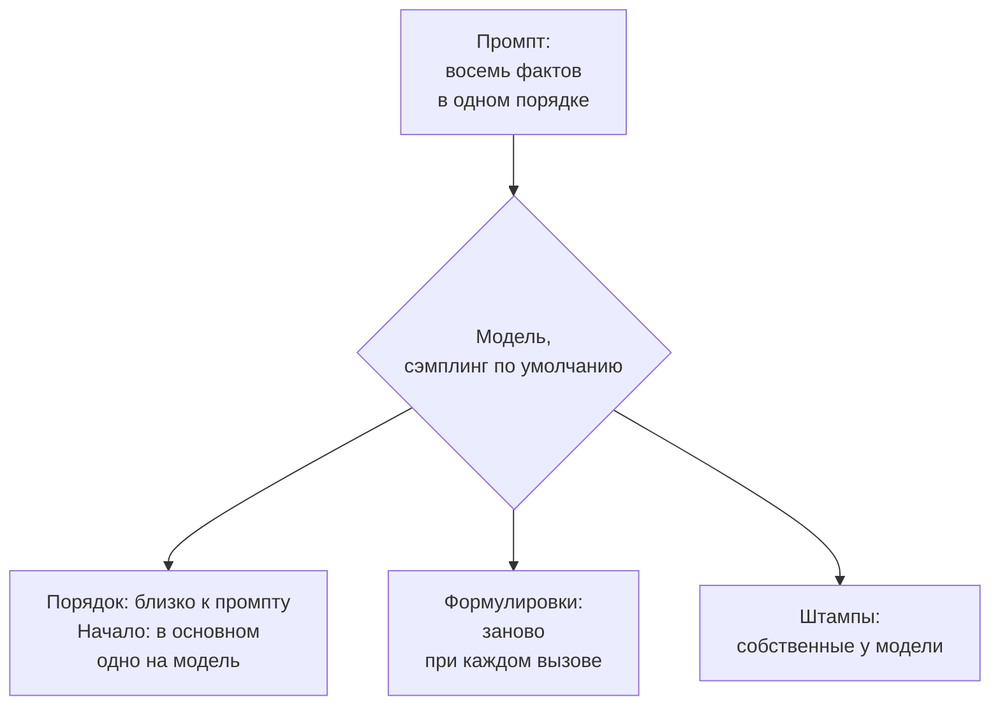
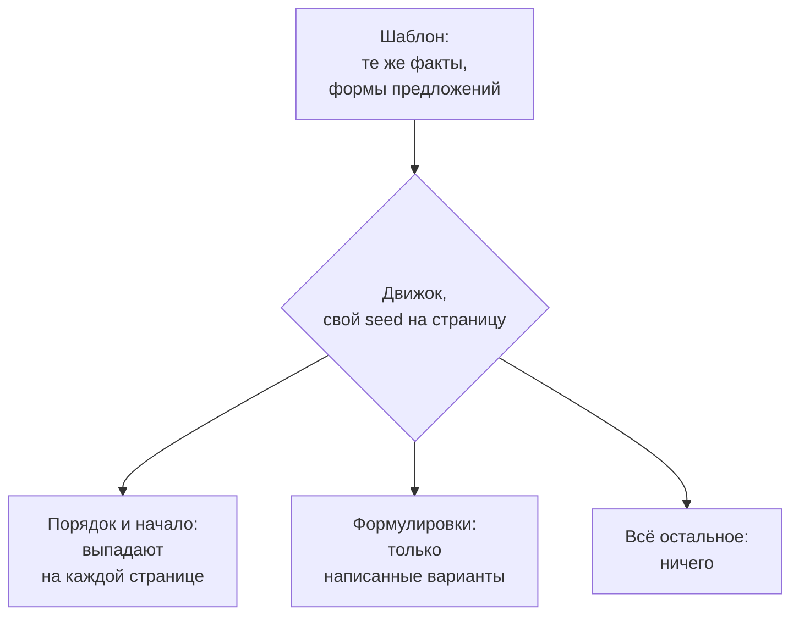

# Почему AI-описания товаров звучат одинаково: замер на 300 описаниях

Один товар, один промпт, три модели по пятьдесят вызовов: что меняется в AI-описаниях, что повторяется, чего стоит просьба о разнообразии и что делает шаблон.

Source: https://ru.spintax.site/why-ai-product-descriptions-sound-the-same/
Published: 2026-09-13
Facts checked: 2026-09-13

---

Кто писал описания товаров нейросетью, знает этот момент: сороковое описание читается как
первое, и все они выходят одинаковые. У исследователей для этого есть название. Статья
Artificial Hivemind с NeurIPS 2025 задавала моделям одни и те же открытые вопросы по 50 раз
и получила вот что:

> Despite using high-stochasticity decoding parameters (top-p = 0.9, t = 1.0), responses from the same model remain highly repetitive, as shown in Figure 4: in 79% of cases, the average similarity exceeds 0.8.

Сходство там — косинус между эмбеддингами текстов, а он высок у любых двух текстов на одну
тему, так что 0.8 не значит, что совпадают 80% слов. NoveltyBench с COLM 2025 считает
разнообразие ответов иначе — по тому, разные ли они по сути, — и приходит туда же: модели
вроде Claude 3 и GPT-4o «produce on average fewer than 3 distinct responses in 10 queries».
И добавляет деталь, важную для того, кто выбирает модель под каталог: «larger models within
a family often exhibit less diversity than their smaller counterparts».

Раньше лекарством была температура. Работа, которая проверила её напрямую, — Peeperkorn
с соавторами, ICCC 2024 — нашла, что «temperature is weakly correlated with novelty, and
unsurprisingly, moderately correlated with incoherence». У новейших флагманских моделей
вопрос закрыт в любом случае. Руководство Anthropic по переходу на Claude Opus 5:

> **Sampling parameters removed:** Setting `temperature`, `top_p`, or `top_k` to any non-default value on Claude Opus 4.7 or later models, including Claude Opus 5, returns a 400 error.

Руководство OpenAI по текущей модели, GPT-6 Astra, числит температуру в «Unsupported
parameters». У этих моделей остаётся только промпт. Поэтому полезный вопрос не в том,
одинаковы ли тексты, а в том, что именно в них одинаково и что из этого промпт может
поменять.

## Один товар, по пятьдесят вызовов каждой модели

Товар — бутылка-термос с восемью фактами: 750 мл, двойная стенка из нержавеющей стали с
вакуумом, 24 часа холод и 12 часов тепло, герметичная крышка с петлёй для переноски, встаёт в
большинство автомобильных подстаканников, 380 г, крышку можно мыть в посудомойке, пять
цветов. Промпт даёт факты в этом порядке и просит около 80 слов одним абзацем. Каждая модель
получила этот промпт 50 раз, каждый вызов — в новой сессии без памяти, 13 сентября 2026
года. Claude Haiku 4.5 и Claude Sonnet 5 работали через CLI Claude Code с выключенными
инструментами и нейтральным системным промптом. GPT-5.6-sol — через CLI Codex в песочнице
только для чтения, с уровнем рассуждений xhigh из локального конфига и со своим системным
промптом Codex, который CLI заменить не даёт. Ни тот, ни другой CLI не выставляет
температуру, так что все вызовы шли со сэмплингом по умолчанию.

Сходство — лексическое, то же, что в [статье про scaled content abuse](/scaled-content-abuse-and-spintax/):
шинглы по пять слов, Jaccard для каждой пары текстов, среднее. У одинаковых текстов 1.000, у
текстов без единой общей пятёрки слов — 0.

| Модель, 50 вызовов | Сходство | Частое начало | Все факты по порядку | Факт потерян |
| --- | --- | --- | --- | --- |
| Claude Haiku 4.5 | 0.084 | «The Kestrel 750», 98% | 12% | 18 |
| Claude Sonnet 5 | 0.205 | «Meet the Kestrel», 100% | 0% | 1 |
| GPT-5.6-sol | 0.342 | «Stay refreshed wherever», 62% | 82% | 2 |

Самая маленькая модель сильнее всех варьирует слова, начинает 49 текстов из 50 с названия
товара и в 18 из них теряет объём: 750 остаётся только в названии. Sonnet 5 начинает все 50 с
«Meet the Kestrel», и во всех 50 есть «everyday companion for» и «crafted from double».
GPT-5.6-sol сохраняет полный порядок промпта в 41 тексте из 50, а два его вызова, #14 и #37,
вернули один и тот же текст слово в слово, вплоть до апострофов. Из двух моделей Claude
бо́льшая сильнее повторяла формулировки — как NoveltyBench и находил внутри семейств.

Модели Claude факты переставляют, но недалеко. Если взять каждую пару фактов в тексте и
проверить, идут ли они в порядке промпта, то так идут 93% пар у Haiku, 88% у Sonnet и 99% у
GPT. Перемешанные факты дали бы около половины. Штампы у модели свои: «just 380 g» в 98%
текстов Sonnet и 94% текстов GPT, «is a premium» в 54% текстов Haiku, хотя слова premium в
промпте не было. Между моделями тексты почти не пересекаются — сходство между пулами от 0.026
до 0.036, — но фразы кочуют: «screw cap features» стоит в 36–66% текстов каждой модели,
«convenient carry loop» — в 48–56%.

## Промпт работает как шаблон

Если положить результат рядом с промптом, промпт со списком фактов ведёт себя как шаблон:
автор задал факты, порядок получился близким к тому, в каком они перечислены, а модель
подставила начало и прилагательные из своих привычек. Следует ли порядок именно за списком,
здесь не проверялось; это показал бы второй промпт с перемешанными фактами.





С обычным промптом сильнее всего меняются формулировки. Первое, что приходит в голову, —
попросить модель менять ещё начало и структуру.

## Просим разнообразия

Два способа попросить, оба на Sonnet 5 — модели с единственным началом. Первый добавляет к
тому же промпту одно предложение: сделай оригинально, избегай начал, фраз и структуры
типичного описания. Второй просит десять описаний за один вызов, каждое заметно отличное от
остальных, — пять вызовов на 50 текстов; NoveltyBench нашёл, что сильнее всего варьирует
модель, которая видит свои прежние ответы.

| Sonnet 5 | Сходство | Начал | Пар по порядку | Факт потерян | Обещание шире |
| --- | --- | --- | --- | --- | --- |
| Обычный промпт | 0.205 | 1 | 88% | 1 | 0 |
| «Сделай оригинально» | 0.017 | 31 | 85% | 10 | 20 |
| Десять за вызов | 0.017 | 41 | 88% | 9 | 2 |

На формулировках работает и то и другое, причём заметно: сходство падает с 0.205 до 0.017,
ниже любого пула с обычным промптом, а начал становится 31 и 41 вместо одного. Порядок почти
не сдвигается. NoveltyBench, который считал разные ответы, а не разные слова, назвал просьбу
«only marginally effective»; по формулировкам наш результат ближе к Verbalized Sampling —
статье 2025 года, где структурированный запрос «increases diversity by 1.6-2.1x over direct
prompting».

Цена видна, когда тексты читаешь, а не считаешь. Попросив оригинальности, модель нашла
новые штампы — «without a fight» в 48% текстов и «cap seals tight» в 46% — и начала улучшать
факты. В промпте бутылка встаёт в большинство автомобильных подстаканников; по правилу из
файла замера в 20 из 50 «оригинальных» текстов она встаёт почти в любой, практически в любой,
в любой или в стандартные подстаканники, а то и в подстаканники повсюду. Некоторые добавили
механику, которой никто не описывал: «the lid lifts out» и «Lid comes apart for the
dishwasher», — а в 10 текстах факт потерян или размыт: например, кофе остаётся «drinkable
past noon» вместо горячего 12 часов. В пакетном варианте 9 текстов из 50 потеряли или
изменили факт, один превратил 24 и 12 часов в «Ice cubes at hour twenty. Steam still rising
at hour ten», а ещё один начался с «380 grams» и утверждения, что бутылка превосходит
«bottles twice its size». Padmakumar с соавторами описывают тот же размен в 2025 году:
приёмы на этапе генерации «have a much smaller effect on novelty, often increasing
originality at the expense of quality».

Каждый из этих текстов читается хорошо. Для каталога в этом и беда: в этом замере найти
расширенное обещание можно было, только прочитав все 50.

## То же описание шаблоном

Последний пул — не модель. Это один шаблон на те же восемь фактов, написанный для этого
эксперимента: три начала, четыре средних предложения по три формы в любом порядке, три
концовки. Рендерит его открытый [@spintax/core](https://spintax.net/spintax-engines/), seed —
номер страницы.

```text
{The Kestrel 750 is {an insulated|a vacuum-insulated} water bottle {that holds 750 ml|with a 750 ml capacity}|Meet the Kestrel 750, a 750 ml {insulated water bottle|vacuum-insulated bottle}|Kestrel 750: a 750 ml {insulated|vacuum-insulated} {water bottle|bottle}}{, built from| made of|, with a body of} double-wall {vacuum stainless steel|stainless steel with a vacuum between the walls}. [{It keeps drinks cold for 24 hours and hot for 12|Drinks stay cold for 24 hours and hot for 12|Cold drinks stay cold for 24 hours, hot ones for 12}.|{The screw cap is leak-proof and has a carry loop|A carry loop sits on the leak-proof screw cap|The leak-proof screw cap comes with a carry loop}.|{It fits most car cup holders and weighs 380 g|At 380 g, it fits most car cup holders|It weighs 380 g and fits most car cup holders}.|{The lid is dishwasher-safe|The lid can go in the dishwasher|The lid goes in the dishwasher}.] {Choose from five colours|It comes in five colours|Five colours are available}.
```

| Пул из 50 | Сходство | Начал | Пар по порядку | Факт потерян | Обещание шире |
| --- | --- | --- | --- | --- | --- |
| Шаблон | 0.165 | 3 | 81% | 0 | 0 |

Это не самый разнообразный пул. По словам он между Haiku и Sonnet, потому что его
неизменные фразы повторяются: «drinks stay cold» стоит в 70% текстов. Тексты у него короче,
61 слово против 80–94, и проще; ничего вроде «your first sip is as good as your last» в нём
нет. И порядок у него не намного свободнее — 81% пар фактов в порядке промпта, — потому что
первое предложение всегда несёт объём и сталь, а последнее — цвета; двигаются только четыре
предложения между ними.

Зато у него есть гарантия, которая следует из устройства. Ни одна страница не скажет того,
чего нет в шаблоне, и ни одна не потеряет факт, так что проверка фактов — это чтение одного
шаблона, а не пятидесяти описаний. На бумаге он даёт 349 920 текстов; 5 000 seed дали 4 965
разных при ожидаемых для такого числа выборок 4 964.

## Где проходит граница

| Способ | Что меняется | Что пошло не так | Что читать |
| --- | --- | --- | --- |
| Один промпт, много вызовов | в основном формулировки | одно преобладающее начало на модель, штампы, потерянный факт, один текст целиком дважды | выборку ради закономерности, каждый текст ради фактов |
| Промпт просит оригинальности | формулировки и начала | расширенные обещания, выдуманные детали, размытые факты | каждый текст, ради фактов |
| Много текстов за вызов | формулировки и начала | потерянные или изменённые факты | каждый текст, ради фактов |
| Шаблон | написанные вами варианты, порядок того, чему вы разрешили двигаться | короче и проще, повторы неизменных фраз | шаблон, один раз |
| Шаблон пишет модель, проверяет человек | варианты, которые модель написала, а вы оставили | то же, что у шаблона, после одного внимательного чтения | шаблон, один раз |

В последней строке два подхода встречаются, и её здесь не замеряли: шаблон выше написан
вручную. Замер показывает другое — куда уходит чтение. Модель, у которой просили пятидесятое
описание, уплывала так, что никто этого не видел; модель, у которой один раз попросили
варианты, собирает всё, что может уплыть, в один текст, который человек в состоянии
проверить.

## Где это ломается

Всё измеренное здесь — одно описание товара, три способа попросить и пять пулов моделей по
50 текстов; генерация шла через два CLI, а не напрямую через API, со сэмплингом по
умолчанию; плюс один шаблон. Сходство считает слова и их порядок, а не смысл, поэтому не
видит, что тексты с одними и теми же фактами — одно и то же предложение. Правила для потерянных и расширенных фактов написаны после чтения
текстов: они считают то, что находится правилом, принимают простые перефразировки и не
заменяют проверку фактов. Шаблон написан под этот эксперимент за один присест, с неизменными
первым и последним предложением; небрежный шаблон поставил бы сломанное предложение на часть
страниц — это показано в [статье про холодные письма](/spintax-in-cold-email-how-much-is-too-much/) на seed 7.

К поиску всё это отношения не имеет. Спам-политика Google распространяется на страницы «no
matter how it's created» и прямо называет в примерах «automated transformations like
synonymizing». Разнообразное описание бутылки остаётся описанием бутылки; помогает ли
кому-то тысяча таких описаний — вопрос к каталогу, и им с тестом занимается
[статья про scaled content abuse](/scaled-content-abuse-and-spintax/).

## Где ручной путь заканчивается

Эксперимент — два файла. [generate.mjs](/measurements/llm-outputs-converge/generate.mjs)
опрашивал модели и сохранил каждый ответ в
[generations.json](/measurements/llm-outputs-converge/generations.json);
[measure.mjs](/measurements/llm-outputs-converge/measure.mjs) читает этот файл и печатает все
числа из статьи, без ключа API:

```bash
npm install @spintax/core@0.6.1
node measure.mjs
```

Для одного товара этого достаточно. Для тысячи SKU работа — это шаг из последней строки
таблицы: заставить модель написать шаблон, а не страницы, и проверить написанное. Это
руководство [AI spintax templates](https://spintax.net/ai-spintax-templates/) на spintax.net
— с промптом, проверкой и ошибками, которые модели делают в spintax;
[нода для n8n](https://spintax.net/spintax-for-n8n/) рендерит строки и меряет уникальность
пула так же, как эта статья, а движок под ней — тот самый пакет, что использован здесь.
